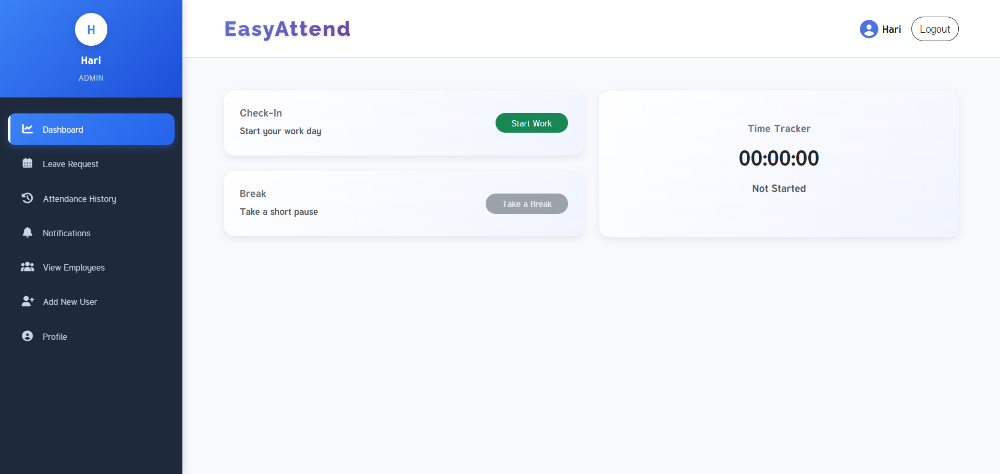

---

# Attendance Management System

A comprehensive **web-based attendance management system** built with **Angular 18+** and modern web technologies. This application provides **role-based access control** for employees and administrators to efficiently manage attendance, leave requests, and notifications.

---

## Features

### For Employees

* Real-time attendance tracking (check-in/check-out with live timer)
* Break management (start & end breaks during work hours)
* Submit leave requests with date range and reason
* Notifications for leave request status (approved/rejected/pending)
* View personal attendance history

### For Administrators

* Manage employee accounts
* Approve/reject leave requests
* Monitor overall employee attendance
* Dashboard with real-time statistics & insights

---

## Technology Stack

* Frontend: Angular 18+ (Standalone Components)
* Language: TypeScript
* Styling: Bootstrap 5 + Custom CSS
* Notifications: SweetAlert2
* Authentication: JWT (Token-based)
* HTTP Client: Angular HttpClient + RxJS

---

## Project Structure

```
src/app/
├── core/
│   ├── guards/           # Route guards (auth, admin, login)
│   └── services/         # Application services
├── features/
│   ├── auth/             # Login & registration
│   ├── dashboard/        # Main dashboard & attendance tracking
│   ├── attendance/       # Attendance history
│   ├── leaves/           # Leave management
│   ├── employees/        # Employee management (Admin only)
│   └── notifications/    # Notification system
├── layout/
│   ├── header/           # Top navigation bar
│   ├── sidebar/          # Sidebar navigation
│   └── layout/           # Layout wrapper
├── docs/
│   └── screenshots/      # Screenshots & demo images
│       ├── dashboard.png
│       ├── leave-management.png
│       ├── attendance-history.png
│       └── mobile-view.png
└── shared/
    └── components/       # Reusable components (404 page, etc.)
```

---

## Getting Started

### Prerequisites

* Node.js (v18+)
* npm or yarn
* Angular CLI (`npm install -g @angular/cli`)

### Installation

1. Clone the repository:

```
git clone <repository-url>
cd frontend_attendanceSystem
```

2. Install dependencies:

```
npm install
```

3. Configure environment:

* Update API endpoints in `src/environments/environment.ts`
* Set backend API URL and other environment variables

4. Run the application:

```
ng serve
```

Open in browser: [http://localhost:4200/](http://localhost:4200/)

5. Build for production:

```
ng build --prod
```

---

## Authentication & Authorization

* Public Routes → Login & Registration
* Protected Routes → Dashboard & Features (requires login)
* Admin Routes → Employee management & leave approvals

### User Roles

* EMPLOYEE → Attendance & leave features
* ADMIN → Full access (employees, approvals, analytics)

---

## Responsive Design

* Desktop → Full features with sidebar navigation
* Tablet → Adaptive layout with collapsible sidebar
* Mobile → Touch-friendly, mobile-optimized UI

---

## UI/UX Highlights

* Modern, clean design with smooth animations
* Interactive elements (hover effects, loading states)
* Accessibility support (ARIA labels, keyboard navigation)
* Consistent color scheme and typography

---

## API Endpoints (Sample)

* POST /api/auth/login → User login
* GET /api/attendance/status → Current attendance status
* POST /api/attendance/checkin → Check-in
* POST /api/attendance/checkout → Check-out
* GET /api/leaves/getleaves → Fetch leave requests
* PUT /api/leaves/update-status → Approve/reject leave

---

## Performance Optimizations

* Lazy Loading → Load feature modules on demand
* OnPush Change Detection → Efficient component updates
* Standalone Components → Smaller bundle size
* Tree Shaking → Remove unused code

---

## Contributing

1. Fork the repository
2. Create a feature branch → `git checkout -b feature/new-feature`
3. Commit changes → `git commit -m "Add new feature"`
4. Push branch → `git push origin feature/new-feature`
5. Create a Pull Request

---

## Version History

* v1.0.0 → Initial release (core attendance features)
* v1.1.0 → Leave management system
* v1.2.0 → Notifications & admin features
* v1.3.0 → Improved UI/UX with responsive design

---

## Screenshots

Dashboard


---

## Live Demo

[Live Demo Link](https://attendance-system-frontend-p8s5.vercel.app/)

---

## Backend Repository

[Attendance Management Backend](https://github.com/harikrishnan2193/)

---

Built using **Angular 18+** and **modern web technologies**